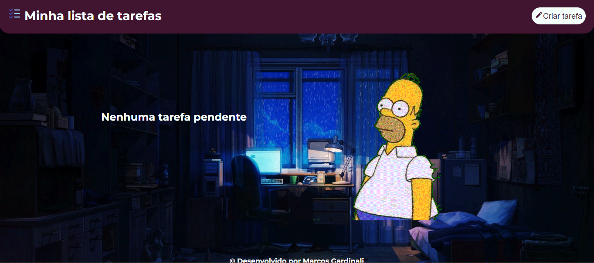
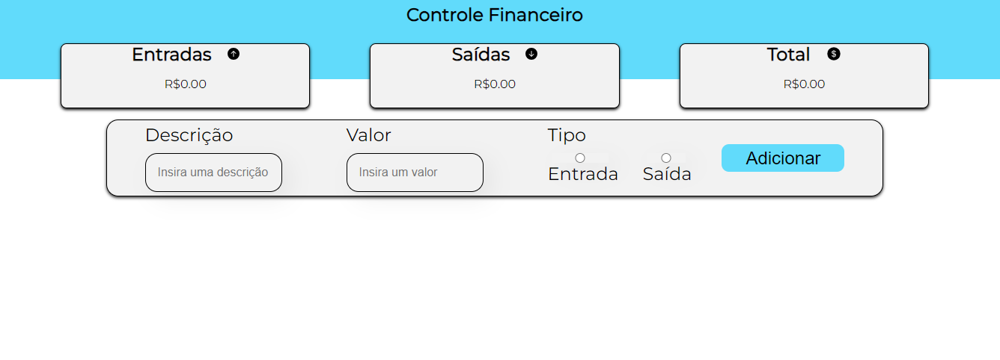

# Portfólio Pessoal em React

Bem-vindo ao meu portfólio pessoal em React! Este projeto foi desenvolvido para apresentar minha jornada no mundo do desenvolvimento e exibir os projetos nos quais tenho trabalhado. Aqui você encontrará informações sobre mim, links para minhas redes sociais e detalhes sobre os projetos mais recentes que realizei.

## Tabela de Conteúdo

- [Sobre Mim](#sobre-mim)
- [Projetos](#projetos)
- [Como Rodar o Projeto](#como-rodar-o-projeto)
- [Contato](#contato)

## Sobre Mim

Olá! Sou Marcos Gardinali, um entusiasta apaixonado por desenvolvimento de software e video games. Minha jornada começou com um grande interesse em programação e design, e desde então tenho trabalhado em diversos projetos para aprimorar minhas habilidades. Adoro explorar novas tecnologias e encontrar soluções criativas para desafios complexos.

## Projetos

Aqui estão alguns dos projetos nos quais tenho trabalhado recentemente:

1. **To-Do List**
   Um projeto de lista de afazeres, onde os afazeres cadastrados são salvos na localStorage do navegador, assim como seu estado de check.

     

2. **React Expenses**
    Um projeto de controle de despesas, podendo cadastrar entradas e saídas, com os dados sendo salvos na localStorage e na tela são exibidas as informações totais de saidas e entradas e um saldo.

      

E assim por diante. Cada projeto possui seu próprio repositório no GitHub, onde você pode conferir o código fonte e detalhes adicionais.

## Como Rodar o Projeto

Se você deseja executar o projeto em sua máquina local, siga estas etapas:

1. Certifique-se de ter o Node.js instalado: [Baixar Node.js](https://nodejs.org/)
2. Clone este repositório: `git clone https://github.com/MarcosGardinali/My_Portfolio.git`
3. Acesse o diretório do projeto: `cd My_Portfolio`
4. Instale as dependências: `npm install`
5. Inicie o servidor de desenvolvimento: `npm start`
6. Abra o navegador e acesse: `http://localhost:3000`

## Contato

Fique à vontade para entrar em contato comigo através das seguintes redes sociais:

- [LinkedIn](https://www.linkedin.com/in/marcos-gardinali)
- [GitHub](https://github.com/MarcosGardinali)

Se você quiser saber mais sobre mim ou discutir oportunidades de colaboração, não hesite em me enviar uma mensagem através das redes sociais.

Obrigado por visitar meu portfólio e espero que você goste dos projetos que apresentei aqui!
